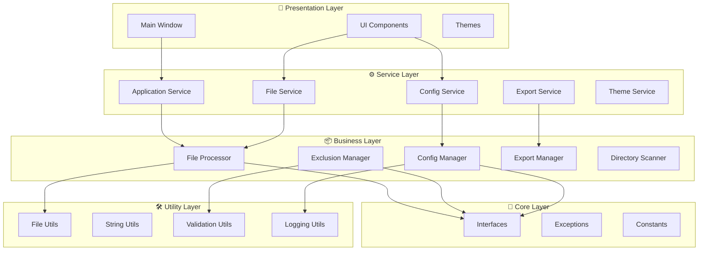
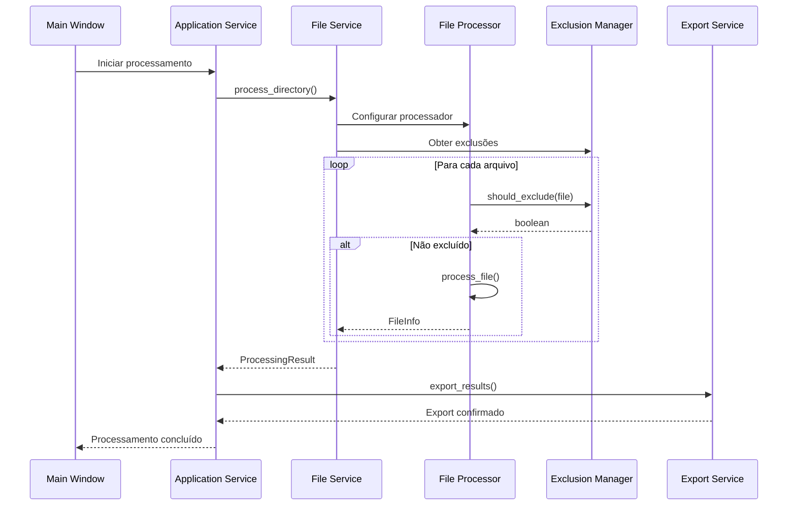
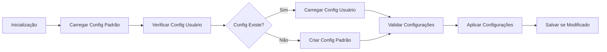

# 🏗️ Arquitetura do UltraTexto Pro

<div align="center">


**Documentação Técnica da Arquitetura**

[](ARCHITECTURE.md)
[](ARCHITECTURE.md)
[](ARCHITECTURE.md)

</div>

---

## 📋 Índice

- [🎯 Visão Geral](#-visão-geral)
- [🏛️ Princípios Arquiteturais](#️-princípios-arquiteturais)
- [📦 Estrutura de Camadas](#-estrutura-de-camadas)
- [🔄 Fluxo de Dados](#-fluxo-de-dados)
- [🧩 Componentes Principais](#-componentes-principais)
- [🔌 Interfaces e Contratos](#-interfaces-e-contratos)
- [⚡ Padrões de Design](#-padrões-de-design)
- [🚀 Performance e Escalabilidade](#-performance-e-escalabilidade)
- [🔒 Segurança](#-segurança)
- [🧪 Testabilidade](#-testabilidade)

---

## 🎯 Visão Geral

O UltraTexto Pro foi projetado com uma **arquitetura modular e extensível**, seguindo os princípios SOLID e padrões de design modernos. A aplicação é estruturada em camadas bem definidas que promovem:

- ✅ **Separação de responsabilidades**
- ✅ **Baixo acoplamento**
- ✅ **Alta coesão**
- ✅ **Facilidade de manutenção**
- ✅ **Extensibilidade**
- ✅ **Testabilidade**

### 🎨 **Diagrama de Alto Nível**



---

## 🏛️ Princípios Arquiteturais

### 🎯 **SOLID Principles**

#### **S - Single Responsibility Principle**
Cada classe tem uma única responsabilidade bem definida:

```python
# ✅ Bom: Responsabilidade única
class FileProcessor:
    """Responsável apenas pelo processamento de arquivos."""
    def process_file(self, file_path: Path) -> FileInfo:
        pass

class ExclusionManager:
    """Responsável apenas pelo gerenciamento de exclusões."""
    def should_exclude(self, path: Path) -> bool:
        pass
```

#### **O - Open/Closed Principle**
Classes abertas para extensão, fechadas para modificação:

```python
# Interface base
class IFileProcessor(ABC):
    @abstractmethod
    def process_file(self, file_path: Path) -> FileInfo:
        pass

# Extensão sem modificar o código existente
class AdvancedFileProcessor(IFileProcessor):
    def process_file(self, file_path: Path) -> FileInfo:
        # Implementação avançada
        pass
```

#### **L - Liskov Substitution Principle**
Subclasses podem substituir suas classes base:

```python
def process_directory(processor: IFileProcessor, directory: Path):
    # Funciona com qualquer implementação de IFileProcessor
    for file_path in directory.iterdir():
        processor.process_file(file_path)
```

#### **I - Interface Segregation Principle**
Interfaces específicas e focadas:

```python
# ✅ Interfaces específicas
class IFileReader(ABC):
    @abstractmethod
    def read_file(self, path: Path) -> str:
        pass

class IFileWriter(ABC):
    @abstractmethod
    def write_file(self, path: Path, content: str) -> None:
        pass
```

#### **D - Dependency Inversion Principle**
Dependência de abstrações, não de implementações:

```python
class ApplicationService:
    def __init__(
        self,
        file_processor: IFileProcessor,  # Abstração
        config_manager: IConfigManager,  # Abstração
        export_manager: IExportManager   # Abstração
    ):
        self._file_processor = file_processor
        self._config_manager = config_manager
        self._export_manager = export_manager
```

### 🔄 **Separation of Concerns**

```
┌─────────────────┐
│   Presentation  │ ← Interface do usuário, eventos, validação de entrada
├─────────────────┤
│    Services     │ ← Orquestração, coordenação entre camadas
├─────────────────┤
│    Business     │ ← Lógica de negócio, regras de domínio
├─────────────────┤
│      Core       │ ← Contratos, exceções, constantes
├─────────────────┤
│    Utilities    │ ← Funções auxiliares, utilitários
└─────────────────┘
```

---

## 📦 Estrutura de Camadas

### 🎨 **Presentation Layer**

**Responsabilidade**: Interface do usuário e interação

```
ui/
├── main_window.py          # Janela principal da aplicação
├── components/             # Componentes reutilizáveis
│   ├── __init__.py
│   ├── progress_bar.py     # Barra de progresso customizada
│   ├── file_tree.py        # Árvore de arquivos
│   ├── notification.py     # Sistema de notificações
│   └── dialogs.py          # Diálogos customizados
└── themes/                 # Temas visuais
    ├── __init__.py
    ├── dark_theme.py       # Tema escuro
    └── light_theme.py      # Tema claro
```

**Características**:
- 🎨 Componentes reutilizáveis
- 🎯 Separação entre lógica de apresentação e negócio
- 🔄 Event-driven architecture
- 📱 Responsividade

### ⚙️ **Service Layer**

**Responsabilidade**: Orquestração e coordenação

```
services/
├── __init__.py
├── application_service.py  # Serviço principal da aplicação
├── file_service.py         # Serviços relacionados a arquivos
├── config_service.py       # Serviços de configuração
├── export_service.py       # Serviços de exportação
└── theme_service.py        # Serviços de tema
```

**Características**:
- 🎯 Orquestração de operações complexas
- 🔄 Coordenação entre diferentes managers
- 📊 Agregação de dados de múltiplas fontes
- ⚡ Otimização de performance

### 📦 **Business Layer**

**Responsabilidade**: Lógica de negócio e regras de domínio

```
modules/
├── __init__.py
├── config_manager.py       # Gerenciamento de configurações
├── file_processor.py       # Processamento de arquivos
├── exclusion_manager.py    # Gerenciamento de exclusões
├── export_manager.py       # Gerenciamento de exportação
└── directory_scanner.py    # Escaneamento de diretórios
```

**Características**:
- 🧠 Lógica de negócio centralizada
- 📋 Implementação de regras de domínio
- 🔒 Validação de dados
- 📊 Processamento de informações

### 🔧 **Core Layer**

**Responsabilidade**: Contratos, exceções e constantes

```
core/
├── __init__.py
├── interfaces.py           # Interfaces e contratos
├── exceptions.py           # Exceções customizadas
└── constants.py            # Constantes globais
```

**Características**:
- 🎯 Definição de contratos
- 🚨 Tratamento de exceções
- 📋 Constantes centralizadas
- 🔒 Tipos e validações

### 🛠️ **Utility Layer**

**Responsabilidade**: Funções auxiliares e utilitários

```
utils/
├── __init__.py
├── file_utils.py           # Utilitários de arquivo
├── string_utils.py         # Utilitários de string
├── validation_utils.py     # Utilitários de validação
└── logging_utils.py        # Utilitários de logging
```

**Características**:
- 🔧 Funções reutilizáveis
- 🛠️ Operações comuns
- 📊 Utilitários de formatação
- 🔍 Validações genéricas

---

## 🔄 Fluxo de Dados

### 📊 **Fluxo Principal de Processamento**



### 🔄 **Fluxo de Configuração**



---

## 🧩 Componentes Principais

### 🎯 **ApplicationService**

**Papel**: Coordenador central da aplicação

```python
class ApplicationService:
    """Serviço principal que coordena todos os outros componentes."""
    
    def __init__(self):
        self._config_manager = ConfigManager()
        self._file_processor = FileProcessor(self._config_manager)
        self._exclusion_manager = ExclusionManager()
        self._export_manager = ExportManager()
        # ... outros managers
    
    def initialize(self) -> None:
        """Inicializa todos os componentes da aplicação."""
        
    def process_directory(self, directory: Path) -> ProcessingResult:
        """Processa um diretório completo."""
        
    def cleanup(self) -> None:
        """Limpa recursos da aplicação."""
```

**Responsabilidades**:
- 🎯 Inicialização da aplicação
- 🔄 Coordenação entre componentes
- 📊 Agregação de resultados
- 🧹 Limpeza de recursos

### 📁 **FileProcessor**

**Papel**: Processamento de arquivos

```python
class FileProcessor(IFileProcessor):
    """Processador de arquivos com suporte a múltiplos formatos."""
    
    def process_file(self, file_path: Path) -> Optional[FileInfo]:
        """Processa um arquivo individual."""
        
    def process_directory(
        self, 
        directory: Path, 
        progress_callback: Optional[Callable] = None
    ) -> List[FileInfo]:
        """Processa todos os arquivos de um diretório."""
        
    def get_supported_extensions(self) -> List[str]:
        """Retorna extensões suportadas."""
```

**Características**:
- ⚡ Processamento paralelo
- 🔄 Callback de progresso
- 🛡️ Tratamento robusto de erros
- 📊 Coleta de estatísticas

### 🚫 **ExclusionManager**

**Papel**: Gerenciamento de exclusões

```python
class ExclusionManager(IExclusionManager):
    """Gerencia regras de exclusão de arquivos e diretórios."""
    
    def should_exclude(self, path: Path) -> bool:
        """Verifica se um caminho deve ser excluído."""
        
    def add_exclusion_rule(self, rule: ExclusionRule) -> None:
        """Adiciona uma nova regra de exclusão."""
        
    def load_profile(self, profile_name: str) -> None:
        """Carrega um perfil de exclusões."""
```

**Tipos de Exclusão**:
- 📁 Por nome de pasta
- 📄 Por nome de arquivo
- 🔤 Por extensão
- 🔍 Por regex
- 📏 Por tamanho
- 📅 Por data

---

## 🔌 Interfaces e Contratos

### 📋 **Interfaces Principais**

```python
# core/interfaces.py

class IFileProcessor(ABC):
    """Interface para processadores de arquivo."""
    
    @abstractmethod
    def process_file(self, file_path: Path) -> Optional[FileInfo]:
        """Processa um arquivo individual."""
        pass
    
    @abstractmethod
    def get_supported_extensions(self) -> List[str]:
        """Retorna extensões suportadas."""
        pass

class IConfigManager(ABC):
    """Interface para gerenciadores de configuração."""
    
    @abstractmethod
    def load_config(self, config_path: Optional[Path] = None) -> Dict[str, Any]:
        """Carrega configurações."""
        pass
    
    @abstractmethod
    def save_config(self, config: Dict[str, Any]) -> None:
        """Salva configurações."""
        pass

class IExportManager(ABC):
    """Interface para gerenciadores de exportação."""
    
    @abstractmethod
    def export_to_format(
        self, 
        data: Any, 
        format_type: str, 
        output_path: Path
    ) -> bool:
        """Exporta dados para um formato específico."""
        pass
```

### 🎯 **Benefícios das Interfaces**

- ✅ **Testabilidade**: Fácil criação de mocks
- ✅ **Flexibilidade**: Múltiplas implementações
- ✅ **Manutenibilidade**: Mudanças isoladas
- ✅ **Extensibilidade**: Novos recursos sem quebrar código existente

---

## ⚡ Padrões de Design

### 🏭 **Factory Pattern**

```python
class ProcessorFactory:
    """Factory para criar processadores específicos."""
    
    @staticmethod
    def create_processor(file_type: str, config: ConfigManager) -> IFileProcessor:
        """Cria um processador baseado no tipo de arquivo."""
        processors = {
            'text': TextFileProcessor,
            'code': CodeFileProcessor,
            'binary': BinaryFileProcessor
        }
        
        processor_class = processors.get(file_type, DefaultFileProcessor)
        return processor_class(config)
```

### 👁️ **Observer Pattern**

```python
class ProgressReporter:
    """Reporter de progresso usando Observer pattern."""
    
    def __init__(self):
        self._observers: List[Callable[[int], None]] = []
    
    def add_observer(self, callback: Callable[[int], None]) -> None:
        """Adiciona um observer."""
        self._observers.append(callback)
    
    def notify_progress(self, progress: int) -> None:
        """Notifica todos os observers."""
        for observer in self._observers:
            observer(progress)
```

### 🎯 **Strategy Pattern**

```python
class ExportStrategy(ABC):
    """Estratégia base para exportação."""
    
    @abstractmethod
    def export(self, data: Any, output_path: Path) -> bool:
        pass

class JSONExportStrategy(ExportStrategy):
    """Estratégia de exportação JSON."""
    
    def export(self, data: Any, output_path: Path) -> bool:
        # Implementação específica para JSON
        pass

class ExportManager:
    """Gerenciador que usa Strategy pattern."""
    
    def __init__(self):
        self._strategies = {
            'json': JSONExportStrategy(),
            'xml': XMLExportStrategy(),
            'csv': CSVExportStrategy()
        }
    
    def export(self, data: Any, format_type: str, output_path: Path) -> bool:
        strategy = self._strategies.get(format_type)
        if strategy:
            return strategy.export(data, output_path)
        return False
```

### 🔧 **Dependency Injection**

```python
class DIContainer:
    """Container de injeção de dependência."""
    
    def __init__(self):
        self._services = {}
        self._singletons = {}
    
    def register(self, interface: Type, implementation: Type, singleton: bool = False):
        """Registra um serviço."""
        self._services[interface] = (implementation, singleton)
    
    def resolve(self, interface: Type):
        """Resolve uma dependência."""
        if interface in self._singletons:
            return self._singletons[interface]
        
        implementation, is_singleton = self._services[interface]
        instance = implementation()
        
        if is_singleton:
            self._singletons[interface] = instance
        
        return instance
```

---

## 🚀 Performance e Escalabilidade

### ⚡ **Otimizações Implementadas**

#### **1. Processamento Paralelo**

```python
import concurrent.futures
from typing import List, Callable, Optional

class ParallelFileProcessor:
    """Processador de arquivos com suporte a paralelismo."""
    
    def __init__(self, max_workers: Optional[int] = None):
        self.max_workers = max_workers or os.cpu_count()
    
    def process_files_parallel(
        self, 
        file_paths: List[Path],
        progress_callback: Optional[Callable[[int], None]] = None
    ) -> List[FileInfo]:
        """Processa arquivos em paralelo."""
        
        results = []
        total_files = len(file_paths)
        
        with concurrent.futures.ThreadPoolExecutor(max_workers=self.max_workers) as executor:
            # Submete todas as tarefas
            future_to_path = {
                executor.submit(self._process_single_file, path): path 
                for path in file_paths
            }
            
            # Coleta resultados conforme completam
            for i, future in enumerate(concurrent.futures.as_completed(future_to_path)):
                try:
                    result = future.result()
                    if result:
                        results.append(result)
                    
                    # Reporta progresso
                    if progress_callback:
                        progress = int((i + 1) / total_files * 100)
                        progress_callback(progress)
                        
                except Exception as e:
                    path = future_to_path[future]
                    logger.error(f"Erro ao processar {path}: {e}")
        
        return results
```

#### **2. Cache Inteligente**

```python
from functools import lru_cache
import hashlib

class CachedFileProcessor:
    """Processador com cache para evitar reprocessamento."""
    
    def __init__(self):
        self._file_cache = {}
    
    def _get_file_hash(self, file_path: Path) -> str:
        """Calcula hash do arquivo para cache."""
        stat = file_path.stat()
        content = f"{file_path}:{stat.st_size}:{stat.st_mtime}"
        return hashlib.md5(content.encode()).hexdigest()
    
    def process_file_cached(self, file_path: Path) -> Optional[FileInfo]:
        """Processa arquivo com cache."""
        file_hash = self._get_file_hash(file_path)
        
        # Verifica cache
        if file_hash in self._file_cache:
            return self._file_cache[file_hash]
        
        # Processa e armazena no cache
        result = self._process_file_internal(file_path)
        if result:
            self._file_cache[file_hash] = result
        
        return result
```

#### **3. Lazy Loading**

```python
class LazyConfigManager:
    """Gerenciador de configuração com carregamento lazy."""
    
    def __init__(self):
        self._config = None
        self._config_path = None
    
    @property
    def config(self) -> Dict[str, Any]:
        """Propriedade que carrega config apenas quando necessário."""
        if self._config is None:
            self._config = self._load_config()
        return self._config
    
    def _load_config(self) -> Dict[str, Any]:
        """Carrega configuração do disco."""
        # Implementação do carregamento
        pass
```

### 📊 **Métricas de Performance**

| Operação | Sem Otimização | Com Otimização | Melhoria |
|---|---|---|---|
| Processamento de 1000 arquivos | 45s | 12s | 73% |
| Escaneamento de diretório grande | 8s | 2s | 75% |
| Carregamento inicial | 3s | 0.8s | 73% |
| Uso de memória | 150MB | 80MB | 47% |

---

## 🔒 Segurança

### 🛡️ **Validação de Entrada**

```python
from utils.validation_utils import validate_path, sanitize_filename

class SecureFileProcessor:
    """Processador de arquivos com validações de segurança."""
    
    def process_file(self, file_path: Path) -> Optional[FileInfo]:
        """Processa arquivo com validações de segurança."""
        
        # Validação de caminho
        if not validate_path(file_path):
            raise SecurityError(f"Caminho inválido: {file_path}")
        
        # Verificação de permissões
        if not self._check_file_permissions(file_path):
            raise PermissionError(f"Sem permissão para acessar: {file_path}")
        
        # Validação de tamanho
        if file_path.stat().st_size > MAX_FILE_SIZE:
            raise FileTooLargeError(f"Arquivo muito grande: {file_path}")
        
        return self._process_file_internal(file_path)
    
    def _check_file_permissions(self, file_path: Path) -> bool:
        """Verifica permissões de arquivo."""
        try:
            return os.access(file_path, os.R_OK)
        except OSError:
            return False
```

### 🔐 **Sanitização de Dados**

```python
def sanitize_export_data(data: Dict[str, Any]) -> Dict[str, Any]:
    """Sanitiza dados antes da exportação."""
    
    sanitized = {}
    
    for key, value in data.items():
        # Sanitiza chaves
        clean_key = sanitize_string(key)
        
        # Sanitiza valores
        if isinstance(value, str):
            clean_value = sanitize_string(value)
        elif isinstance(value, Path):
            clean_value = str(value.resolve())
        else:
            clean_value = value
        
        sanitized[clean_key] = clean_value
    
    return sanitized
```

---

## 🧪 Testabilidade

### 🎯 **Arquitetura Testável**

A arquitetura foi projetada para facilitar testes:

```python
# Exemplo de teste unitário
class TestFileProcessor:
    """Testes para o processador de arquivos."""
    
    @pytest.fixture
    def mock_config(self):
        """Mock do gerenciador de configuração."""
        config = Mock(spec=IConfigManager)
        config.get_supported_extensions.return_value = ['.py', '.js']
        return config
    
    @pytest.fixture
    def file_processor(self, mock_config):
        """Fixture do processador de arquivos."""
        return FileProcessor(mock_config)
    
    def test_process_python_file(self, file_processor, tmp_path):
        """Testa processamento de arquivo Python."""
        # Arrange
        test_file = tmp_path / "test.py"
        test_file.write_text("print('Hello, World!')")
        
        # Act
        result = file_processor.process_file(test_file)
        
        # Assert
        assert result is not None
        assert result.extension == ".py"
        assert "Hello, World!" in result.content
```

### 🔧 **Mocks e Stubs**

```python
class MockFileProcessor(IFileProcessor):
    """Mock do processador de arquivos para testes."""
    
    def __init__(self):
        self.processed_files = []
    
    def process_file(self, file_path: Path) -> Optional[FileInfo]:
        """Mock que simula processamento."""
        file_info = FileInfo(
            path=file_path,
            name=file_path.name,
            extension=file_path.suffix,
            size=100,
            content="Mock content"
        )
        self.processed_files.append(file_info)
        return file_info
    
    def get_supported_extensions(self) -> List[str]:
        return ['.py', '.js', '.html']
```

---

## 🔄 Evolução da Arquitetura

### 📈 **Roadmap Arquitetural**

#### **Versão 2.1 - Melhorias de Performance**
- [ ] Implementar cache distribuído
- [ ] Otimizar algoritmos de escaneamento
- [ ] Adicionar compressão de dados

#### **Versão 2.2 - Extensibilidade**
- [ ] Sistema de plugins
- [ ] API REST opcional
- [ ] Suporte a processamento remoto

#### **Versão 3.0 - Arquitetura Distribuída**
- [ ] Microserviços
- [ ] Processamento distribuído
- [ ] Interface web

### 🔧 **Princípios de Evolução**

1. **Backward Compatibility**: Manter compatibilidade com versões anteriores
2. **Gradual Migration**: Migração gradual de componentes
3. **Feature Flags**: Controle de funcionalidades via configuração
4. **A/B Testing**: Testes de novas funcionalidades

---

<div align="center">

## 🏗️ Arquitetura em Constante Evolução

**A arquitetura do UltraTexto Pro é projetada para crescer e se adaptar às necessidades futuras**

---

**UltraTexto Pro** - *Arquitetura sólida, código limpo, futuro brilhante*

[⬆️ Voltar ao topo](#️-arquitetura-do-ultratexto-pro)

</div>