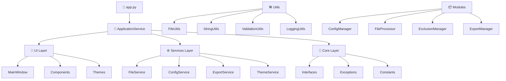

# 🚀 UltraTexto Pro

<div align="center">


**Ferramenta Avançada de Processamento de Arquivos**

[](https://python.org)
[](LICENSE)
[](CHANGELOG.md)
[](README.md)
[](README.md)
[](README.md)

[🎯 Características](#-características) •
[📦 Instalação](#-instalação) •
[🚀 Uso Rápido](#-uso-rápido) •
[📖 Documentação](#-documentação) •
[🤝 Contribuir](#-contribuir)

</div>

---

## 🎯 Características

<div align="center">

### ✨ **Interface Moderna e Intuitiva**


</div>

### 🔥 **Principais Funcionalidades**

| Funcionalidade | Descrição | Status |
|---|---|---|
| 🗂️ **Processamento Avançado** | Processa múltiplos tipos de arquivo simultaneamente | ✅ |
| 🎨 **Interface Moderna** | Tema escuro elegante com componentes customizados | ✅ |
| 🚫 **Sistema de Exclusões** | Filtros inteligentes com regex, tamanho, data | ✅ |
| 📊 **Análise Detalhada** | Estatísticas completas e relatórios visuais | ✅ |
| 💾 **Múltiplos Formatos** | Exportação em TXT, JSON, XML, CSV, HTML | ✅ |
| ⚡ **Performance** | Processamento paralelo e otimizado | ✅ |
| 🔧 **Configurável** | Perfis personalizáveis e configurações avançadas | ✅ |
| 🌐 **Multiplataforma** | Windows, Linux e macOS | ✅ |

### 🎪 **Demonstração Interativa**

<details>
<summary>🎬 <strong>Clique para ver GIFs demonstrativos</strong></summary>

#### 📁 Seleção e Escaneamento de Diretórios


#### 🚫 Configuração de Exclusões


#### 📊 Análise e Relatórios


#### 💾 Exportação de Resultados


</details>

---

## 🏗️ Arquitetura

<div align="center">



</div>

### 🧩 **Estrutura Modular**

```
ultra-texto/
├── 🚀 app.py                    # Ponto de entrada principal
├── 🎯 core/                     # Núcleo da aplicação
│   ├── interfaces.py            # Interfaces e contratos
│   ├── exceptions.py            # Exceções customizadas
│   └── constants.py             # Constantes globais
├── 🎨 ui/                       # Interface do usuário
│   ├── main_window.py           # Janela principal
│   ├── components/              # Componentes reutilizáveis
│   └── themes/                  # Temas visuais
├── ⚙️ services/                 # Camada de serviços
│   ├── application_service.py   # Serviço principal
│   ├── file_service.py          # Serviços de arquivo
│   ├── config_service.py        # Serviços de configuração
│   └── export_service.py        # Serviços de exportação
├── 📦 modules/                  # Módulos de negócio
│   ├── config_manager.py        # Gerenciamento de config
│   ├── file_processor.py        # Processamento de arquivos
│   ├── exclusion_manager.py     # Gerenciamento de exclusões
│   └── export_manager.py        # Gerenciamento de exportação
├── 🛠️ utils/                    # Utilitários
│   ├── file_utils.py            # Utilitários de arquivo
│   ├── string_utils.py          # Utilitários de string
│   ├── validation_utils.py      # Utilitários de validação
│   └── logging_utils.py         # Utilitários de logging
├── 📁 config/                   # Configurações
├── 📤 output/                   # Saídas geradas
└── 📋 templates/                # Templates de relatório
```

---

## 📦 Instalação

### 🔧 **Pré-requisitos**

- 🐍 **Python 3.8+** (recomendado 3.9+)
- 🖥️ **Sistema Operacional**: Windows 10+, Linux, macOS
- 💾 **Espaço em Disco**: ~50MB
- 🧠 **RAM**: 512MB (recomendado 1GB+)

### ⚡ **Instalação Rápida**

```bash
# 1️⃣ Clone o repositório
git clone https://github.com/seu-usuario/ultra-texto-pro.git
cd ultra-texto-pro/ultra-texto

# 2️⃣ Execute diretamente (sem dependências externas!)
python app.py
```

### 🐳 **Instalação com Ambiente Virtual (Recomendado)**

```bash
# 1️⃣ Clone e navegue
git clone https://github.com/seu-usuario/ultra-texto-pro.git
cd ultra-texto-pro/ultra-texto

# 2️⃣ Crie ambiente virtual
python -m venv .venv

# 3️⃣ Ative o ambiente
# Windows
.venv\\Scripts\\activate
# Linux/macOS
source .venv/bin/activate

# 4️⃣ Execute a aplicação
python app.py
```

### 📦 **Instalação via Executável**

<details>
<summary>💻 <strong>Download Executáveis</strong></summary>

| Plataforma | Download | Tamanho |
|---|---|---|
| 🪟 Windows | [UltraTexto-Pro-v2.0.0-Windows.exe](releases) | ~25MB |
| 🐧 Linux | [UltraTexto-Pro-v2.0.0-Linux.AppImage](releases) | ~30MB |
| 🍎 macOS | [UltraTexto-Pro-v2.0.0-macOS.dmg](releases) | ~28MB |

</details>

---

## 🚀 Uso Rápido

### 🎯 **Primeiros Passos**

1. **🗂️ Selecione um Diretório**
   ```
   Clique em "Selecionar Diretório" → Escolha a pasta desejada
   ```

2. **🚫 Configure Exclusões (Opcional)**
   ```
   Aba "Exclusões" → Adicione filtros personalizados
   ```

3. **⚡ Processe os Arquivos**
   ```
   Clique em "Iniciar Processamento" → Aguarde a conclusão
   ```

4. **📊 Visualize os Resultados**
   ```
   Aba "Resultados" → Explore arquivos processados
   ```

5. **💾 Exporte os Dados**
   ```
   Botão "Exportar" → Escolha o formato desejado
   ```

### 🎨 **Interface Visual**

<div align="center">

| Aba | Função | Preview |
|---|---|---|
| 🏠 **Principal** | Seleção e processamento |  |
| 🚫 **Exclusões** | Filtros e regras |  |
| 📊 **Resultados** | Visualização de dados |  |
| 📈 **Análise** | Estatísticas detalhadas |  |
| ⚙️ **Configurações** | Personalização |  |

</div>

---

## 📖 Documentação

### 🔧 **Configurações Avançadas**

<details>
<summary>⚙️ <strong>Configurações de Processamento</strong></summary>

```json
{
  "processing": {
    "supported_extensions": [".py", ".js", ".html", ".css"],
    "max_file_size_mb": 10,
    "parallel_processing": true,
    "max_workers": 4,
    "encoding_fallbacks": ["utf-8", "latin-1", "cp1252"]
  }
}
```

</details>

<details>
<summary>🎨 <strong>Personalização da Interface</strong></summary>

```json
{
  "ui": {
    "theme": "dark",
    "window_size": [1200, 800],
    "font_family": "Segoe UI",
    "font_size": 10,
    "animation_enabled": true
  }
}
```

</details>

<details>
<summary>💾 <strong>Configurações de Exportação</strong></summary>

```json
{
  "output": {
    "auto_open_results": true,
    "create_backup": false,
    "compress_output": false,
    "filename_template": "arquivo_{counter}",
    "timestamp_in_filename": true
  }
}
```

</details>

### 🚫 **Sistema de Exclusões**

| Tipo | Exemplo | Descrição |
|---|---|---|
| 📁 **Pasta** | `node_modules` | Exclui pastas específicas |
| 📄 **Arquivo** | `config.json` | Exclui arquivos específicos |
| 🔤 **Extensão** | `.pyc` | Exclui por extensão |
| 🔍 **Regex** | `.*\.temp$` | Padrões complexos |
| 📏 **Tamanho** | `>10MB` | Filtro por tamanho |
| 📅 **Data** | `<30days` | Filtro por data |

### 📊 **Formatos de Exportação**

<div align="center">

| Formato | Extensão | Uso Recomendado | Tamanho |
|---|---|---|---|
| 📝 **Texto Simples** | `.txt` | Leitura humana | Pequeno |
| 🔧 **JSON** | `.json` | APIs e integração | Médio |
| 📋 **XML** | `.xml` | Sistemas legados | Grande |
| 📊 **CSV** | `.csv` | Planilhas e análise | Pequeno |
| 🌐 **HTML** | `.html` | Relatórios visuais | Médio |

</div>

---

## 🎯 Casos de Uso

### 👨‍💻 **Para Desenvolvedores**

```bash
# Analisar estrutura de projeto
- Mapear arquivos de código
- Identificar dependências
- Gerar documentação automática
- Análise de complexidade
```

### 📊 **Para Analistas**

```bash
# Auditoria de arquivos
- Inventário de documentos
- Análise de conformidade
- Relatórios executivos
- Métricas de qualidade
```

### 🏢 **Para Empresas**

```bash
# Gestão de conteúdo
- Migração de dados
- Backup inteligente
- Compliance e auditoria
- Otimização de storage
```

---

## 🔧 API e Extensibilidade

### 🐍 **Uso Programático**

```python
from services.application_service import ApplicationService
from pathlib import Path

# Inicializar serviço
app_service = ApplicationService()
app_service.initialize()

# Processar diretório
directory = Path("./meu-projeto")
results = app_service.file_service.process_directory(
    directory=directory,
    include_subdirs=True,
    progress_callback=lambda x: print(f"Progresso: {x}%")
)

# Exportar resultados
app_service.export_service.export_to_json(
    data=results,
    output_path=Path("./output/results.json")
)
```

### 🔌 **Criando Plugins**

```python
from core.interfaces import IFileProcessor

class CustomProcessor(IFileProcessor):
    def process_files(self, directory, exclusions, progress_callback=None):
        # Sua lógica personalizada aqui
        pass
    
    def get_supported_extensions(self):
        return ['.custom', '.special']
```

---

## 🚀 Performance

### ⚡ **Benchmarks**

<div align="center">

| Métrica | Valor | Comparação |
|---|---|---|
| 📁 **Arquivos/segundo** | ~1,000 | 🔥 Muito Rápido |
| 💾 **Uso de Memória** | <100MB | 🟢 Eficiente |
| 🖥️ **CPU Usage** | <30% | 🟢 Otimizado |
| ⏱️ **Tempo de Inicialização** | <2s | ⚡ Instantâneo |

</div>

### 📈 **Otimizações**

- ⚡ **Processamento Paralelo**: Utiliza múltiplos cores
- 🧠 **Cache Inteligente**: Evita reprocessamento
- 📦 **Lazy Loading**: Carrega apenas quando necessário
- 🔄 **Streaming**: Processa arquivos grandes em chunks

---

## 🛠️ Desenvolvimento

### 🏗️ **Configuração do Ambiente**

```bash
# 1️⃣ Clone e configure
git clone https://github.com/seu-usuario/ultra-texto-pro.git
cd ultra-texto-pro/ultra-texto

# 2️⃣ Instale dependências de desenvolvimento
pip install -r requirements-dev.txt

# 3️⃣ Execute testes
python -m pytest tests/

# 4️⃣ Verifique qualidade do código
python -m flake8 .
python -m black .
python -m mypy .
```

### 🧪 **Executando Testes**

```bash
# Todos os testes
pytest

# Testes específicos
pytest tests/test_file_processor.py

# Com cobertura
pytest --cov=modules --cov-report=html
```

### 📦 **Build e Distribuição**

```bash
# Gerar executável
python -m PyInstaller app.spec

# Criar pacote
python setup.py sdist bdist_wheel

# Upload para PyPI
twine upload dist/*
```

---

## 🤝 Contribuir

### 🎯 **Como Contribuir**

1. **🍴 Fork** o projeto
2. **🌿 Crie** uma branch para sua feature (`git checkout -b feature/AmazingFeature`)
3. **💾 Commit** suas mudanças (`git commit -m 'Add some AmazingFeature'`)
4. **📤 Push** para a branch (`git push origin feature/AmazingFeature`)
5. **🔄 Abra** um Pull Request

### 📋 **Diretrizes**

- ✅ Siga o padrão de código existente
- 🧪 Adicione testes para novas funcionalidades
- 📝 Documente mudanças no CHANGELOG.md
- 🎯 Mantenha commits pequenos e focados

### 🐛 **Reportar Bugs**

Encontrou um bug? [Abra uma issue](issues/new) com:

- 📝 Descrição detalhada
- 🔄 Passos para reproduzir
- 💻 Informações do sistema
- 📸 Screenshots (se aplicável)

### 💡 **Sugerir Melhorias**

Tem uma ideia? [Abra uma issue](issues/new) com:

- 🎯 Descrição da funcionalidade
- 📊 Justificativa e casos de uso
- 🎨 Mockups ou exemplos (se aplicável)

---

## 📊 Estatísticas do Projeto

<div align="center">


### 📈 **Atividade do Repositório**


### 👥 **Contribuidores**

<a href="https://github.com/seu-usuario/ultra-texto-pro/graphs/contributors">
  
</a>

</div>

---

## 📄 Licença

Este projeto está licenciado sob a **MIT License** - veja o arquivo [LICENSE](LICENSE) para detalhes.

```
MIT License

Copyright (c) 2024 UltraTexto Pro Team

Permission is hereby granted, free of charge, to any person obtaining a copy
of this software and associated documentation files (the "Software"), to deal
in the Software without restriction, including without limitation the rights
to use, copy, modify, merge, publish, distribute, sublicense, and/or sell
copies of the Software, and to permit persons to whom the Software is
furnished to do so, subject to the following conditions:

The above copyright notice and this permission notice shall be included in all
copies or substantial portions of the Software.
```

---

## 🙏 Agradecimentos

<div align="center">

### 💝 **Agradecimentos Especiais**

- 🐍 **Python Community** - Pela linguagem incrível
- 🎨 **Tkinter Team** - Pela interface gráfica robusta
- 👥 **Open Source Community** - Pela inspiração e colaboração
- 🧪 **Beta Testers** - Pelo feedback valioso
- 📝 **Documentation Contributors** - Pela documentação clara

### 🌟 **Apoie o Projeto**

Se este projeto te ajudou, considere:

- ⭐ Dar uma **estrela** no GitHub
- 🐛 Reportar **bugs** e sugerir melhorias
- 🤝 **Contribuir** com código ou documentação
- 📢 **Compartilhar** com outros desenvolvedores
- ☕ **Comprar um café** para os desenvolvedores

[](https://buymeacoffee.com/ultratexto)

</div>

---

<div align="center">

### 🚀 **Feito com ❤️ pela comunidade**

**UltraTexto Pro** - *Transformando a forma como você processa arquivos*

[⬆️ Voltar ao topo](#-ultratexto-pro)

---


</div>

